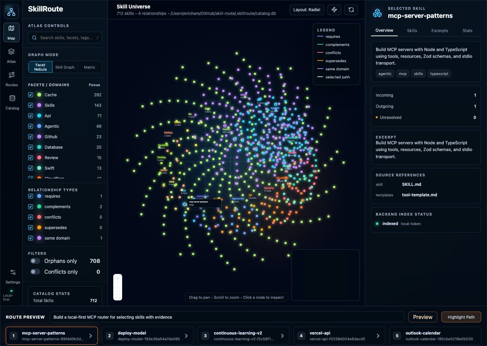
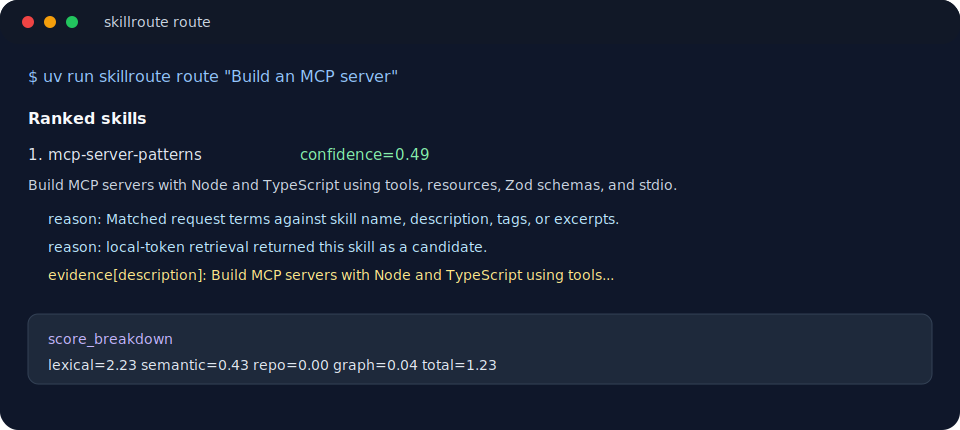
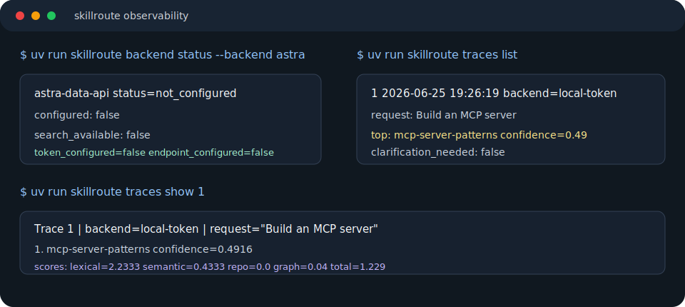

# SkillRoute

Local-first skill routing for agent builders.

SkillRoute indexes full `SKILL.md` bundles, stores reviewed metadata in SQLite,
and returns ranked skill plans with confidence, evidence, score breakdowns, and
clarification prompts when the route is uncertain.


## Why

Most agents pick skills from a tiny description. SkillRoute gives them a real
catalog: parsed skill bundles, facets, graph relationships, backend retrieval,
golden-route evals, and inspectable routing traces.

## Quick Start

One-line SkillRoute installer:

```bash
curl -fsSL https://raw.githubusercontent.com/erichare/skill-route/main/scripts/install.sh | bash
```

It confirms each step, installs SkillRoute into `~/.skillroute/skill-route` by
default, bootstraps the MCP server, detects supported agent clients, and offers
to set up each detected client with backups for edited JSON config files.

Already in a checkout:

```bash
./scripts/bootstrap.sh
uv run skillroute route "Build an MCP server that exposes routing tools"
uv run skillroute ui
```

Manual setup is still just a few commands:

```bash
uv run skillroute index --root examples/skills
uv run skillroute route "Build an MCP server that exposes routing tools"
uv run skillroute inspect mcp-server-patterns
```

The default catalog is `.skillroute/catalog.db`. Use `--catalog <path>` or
`SKILLROUTE_CATALOG_PATH` when you want an explicit catalog.

## Screenshots

Skill Atlas, the local graph UI for exploring skills, relationships, and route
previews:



CLI route output:



Trace inspection:



## What You Get

- Hybrid routing over lexical metadata, local/remote retrieval, repo context,
  and skill graph signals.
- Local SQLite catalog with skills, excerpts, relationships, backend refs,
  and route traces.
- Optional Astra DB Data API retrieval backend.
- TypeScript MCP server exposing `skillroute.route`, `skillroute.search`, and
  `skillroute.inspect_skill`.
- CLI tools for indexing, routing, search, metadata review, backend status,
  trace inspection, and golden-route evals.
- Skill Atlas web UI for exploring the local skill graph, facets, relationships,
  route previews, and source evidence.

## Docs

- [Getting Started](docs/getting-started.md)
- [Agent Setup](docs/agent-setup.md)
- [Astra Data API Backend](docs/astra-backend.md)
- [Metadata Overlays](docs/metadata-overlays.md)
- [Route Observability](docs/route-observability.md)
- [Skill Atlas UI](docs/skill-atlas.md)
- [MCP Server](docs/mcp-server.md)
- [Golden Route Evals](docs/evals.md)
- [Roadmap](docs/roadmap.md)

## Core Commands

```bash
uv run skillroute mcp config --client ibm-bob
uv run skillroute mcp config --client codex
uv run skillroute mcp config --client claude-code
uv run skillroute mcp config --client vscode
uv run skillroute mcp config --client windsurf
uv run skillroute mcp config --client cursor
uv run skillroute search "Astra vector backend"
uv run skillroute eval run --fresh --index-root examples/skills --cases examples/evals/golden_routes.json
uv run skillroute backend status --backend astra
uv run skillroute traces list
uv run skillroute ui
```

## Current Shape

- Python core: parsing, catalog persistence, routing, adapters, evals, and CLI.
- Skill Atlas UI: local FastAPI server plus React Flow/Vite frontend.
- TypeScript MCP: local stdio transport around the Python bridge.
- Retrieval adapters: local token backend by default, with Astra DB Data API and
  LangChain-compatible adapter contracts.

## Development

```bash
uv run --extra dev pytest --cov=skillroute --cov-report=term-missing
uv run --extra dev ruff check .
npm --prefix web ci && npm --prefix web run typecheck && npm --prefix web run lint && npm --prefix web run test && npm --prefix web run build
cd mcp && npm ci && npm run build && npm run typecheck && npm run smoke
```
