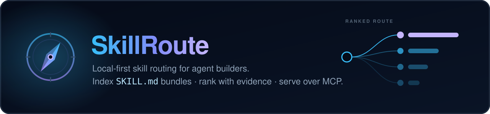
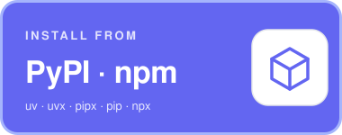
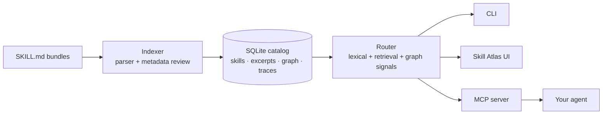

<p align="center">
  
</p>

<p align="center">
  <a href="https://github.com/erichare/skillroute/actions/workflows/ci.yml"></a>
  <a href="https://pypi.org/project/skillroute/"></a>
  <a href="https://www.npmjs.com/package/@skillroute/mcp-server"></a>
  <a href="https://pypi.org/project/skillroute/"></a>
  <a href="LICENSE"></a>
</p>

<p align="center">
  <b>15 harnesses · 3 MCP tools · 4 retrieval backends · full <code>SKILL.md</code> bundle indexing · zero runtime dependencies</b>
</p>

<p align="center">
  <a href="#install">Install</a> ·
  <a href="#what-you-get">What you get</a> ·
  <a href="#skill-atlas">Skill Atlas</a> ·
  <a href="#trust">Trust</a> ·
  <a href="#route-observability">Observability</a> ·
  <a href="#how-it-works">How it works</a> ·
  <a href="#docs">Docs</a>
</p>

> **Built on the [Agent Skills](https://agentskills.io/home) open standard.** Every bundle SkillRoute
> indexes is checked against the [specification](https://agentskills.io/specification), and the
> standalone validator doubles as a CI gate for skill authors.

Most agents choose a skill from a one-line description and hope for the best. SkillRoute treats your
skill library like a real corpus: it parses complete `SKILL.md` bundles — headings, triggers,
templates, relationships — ranks them with **confidence and source evidence**, returns a
clarification question instead of a guess when the route is uncertain, and serves the whole thing to
any agent over MCP. One SQLite file, no services to run; add the Astra DB backend when you outgrow it.

<p align="center">
  
</p>

<p align="center">
  <sub><b>Skill Atlas</b> — every skill in your library on one interactive map, with live route previews.</sub>
</p>

## Install

Three ways in — pick one.

<p align="center">
  <a href="#one-line-installer"></a>
  <a href="#from-pypi-or-npm"></a>
  <a href="#wire-up-your-agent"></a>
</p>

### One-line installer

```bash
curl -fsSL https://raw.githubusercontent.com/erichare/skillroute/main/scripts/install.sh | bash
```

Confirms each step before it runs: clones or updates SkillRoute, installs dependencies, builds the
MCP server and Skill Atlas, indexes starter skills, then detects your agent clients and offers setup
for each one (JSON edits are backed up first). Add `-s -- --yes` for unattended installs.

### From PyPI or npm

```bash
uv tool install "skillroute[ui]"     # or: pipx install "skillroute[ui]"
skillroute index --root ./skills
skillroute route "Build an MCP server that exposes routing tools"
```

Zero-install works too — `uvx --from skillroute skillroute route "…"`. The MCP server is published
separately as [`@skillroute/mcp-server`](https://www.npmjs.com/package/@skillroute/mcp-server) if you
want to run it straight from npm.


<details>
<summary><b>Actual text output</b></summary>

<br>

```text
Ranked skills:
1. mcp-server-patterns (mcp-server-patterns-99fdd0b3d944c32a) confidence=0.3563
   Build MCP servers with Node and TypeScript using tools, resources, Zod schemas, and stdio transport.
   reason: Matched request terms against skill name, description, tags, or excerpts.
   reason: local-token retrieval returned this skill as a candidate.
   reason: Skill graph relationships provide supporting context.
   evidence[description]: Build MCP servers with Node and TypeScript using tools, resources, Zod schemas, and stdio transport.
   evidence[headings]: MCP Server Patterns; When to Use
2. python-testing (python-testing-19ef6ae9ced445b2) confidence=0.1373
   Test Python applications with pytest fixtures, parametrization, temporary paths, and regression coverage.
   ...
```

</details>

The default catalog lives at `~/.skillroute/catalog.db`. A `.skillroute/catalog.db` in the working
directory is used instead when one already exists, so existing project catalogs keep working; point
elsewhere with `--catalog <path>` or `SKILLROUTE_CATALOG_PATH`.

### Wire up your agent

The bundled MCP server exposes three tools over stdio — `skillroute.route`, `skillroute.search`, and
`skillroute.inspect_skill`. One command writes the config for your harness:

```bash
skillroute harness install claude-code
skillroute harness detect        # what is installed here
skillroute harness list          # everything SkillRoute knows about
```

`amp` · `claude-code` · `claude-desktop` · `codex` · `cursor` · `deepseek` · `gemini-cli` · `goose` ·
`hermes` · `ibm-bob` · `opencode` · `pi` · `vscode` · `windsurf` · `zed`

Each one is a single declarative manifest in [`harnesses/`](harnesses), so adding a new tool is
usually a data change with no Python — see [Harness Packs](docs/harnesses.md).

<details>
<summary><b>DeepSeek Harness</b> — installs as a bundle instead</summary>

<br>

```bash
dsh plugin --profile web add @skillroute/dsh-plugin
```

The bundle registers SkillRoute's MCP server through dsh's built-in `@deepseek-ai/dsh-mcp-client`,
giving agents `mcp__skillroute__route`, `mcp__skillroute__search`, and
`mcp__skillroute__inspect_skill`. The Python core is zero-install when `uv` is present (the bridge
runs `uvx --from skillroute`); otherwise `pipx install skillroute` once. See
[`dsh-plugin/README.md`](dsh-plugin/README.md).

</details>

## What you get

| Component | What it does | Ships in |
| --- | --- | --- |
| **CLI** `skillroute` | Index, route, search, inspect, validate, traces, evals, harness setup | PyPI wheel |
| **MCP server** | Three stdio tools: `route` · `search` · `inspect_skill` | npm `@skillroute/mcp-server`, bundled in the wheel |
| **Skill Atlas** | FastAPI + React Flow graph explorer, facet nebula and matrix views | wheel, `[ui]` extra |
| **Harness packs** | 15 declarative manifests, 6 install modes (`mcp` · `acp` · `skills` · `hook` · `extension` · `router_skill`) | wheel |
| **Retrieval backends** | local token · SQLite FTS5 (BM25) · Astra DB Data API · LangChain adapter | wheel |
| **Spec validator** | Agent Skills compliance check, usable as a CI gate | wheel |
| **DeepSeek bundle** | dsh plugin wiring the MCP server into DeepSeek Harness | npm `@skillroute/dsh-plugin` |

**Zero runtime dependencies.** Routing, indexing, search, and harness setup are stdlib-only. FastAPI
and uvicorn live in the `ui` extra, so an install that never opens the Skill Atlas never fetches a
Rust extension.

## Spec compliance

```bash
skillroute validate examples/skills               # report
skillroute validate --strict                      # fail on warnings too
skillroute index --root examples/skills --strict  # refuse non-compliant bundles
```

```text
Spec check (https://agentskills.io/specification): 4 bundles, 0 errors, 0 warnings
```

See [Spec Compliance](docs/spec-compliance.md) for the full rule set.

## Trust

Spec compliance is a correctness check, not a security one — a bundle can be perfectly valid and
still tell your agent to read `~/.aws/credentials`. A skill's body is instructions the model obeys,
so a skill library is a supply chain, and the nastiest failure is the **rug-pull**: a bundle you
reviewed is edited later, its `name` and `description` untouched, and nothing in the index looks
different.

[toolprint](https://github.com/jestatsio/toolprint) closes that gap. It hashes each bundle —
frontmatter *and* body — into a committed lockfile, and scans the prose for injection patterns:

```bash
npx toolprint pin  --skills ./skills     # commit toolprint.lock
npx toolprint scan --skills ./skills     # a body-only edit now fails
```

SkillRoute gates itself the same way: `toolprint.lock` pins this repo's own MCP server and example
skill library, and CI verifies both on every pull request. See [Security](docs/security.md).

## Skill Atlas

Your whole library, mapped. Facet nebula, skill graph, and matrix views; filters for domains,
relationship types, orphans, and conflicts; a detail panel with excerpts and source references; and a
route preview bar that highlights the chosen path through the graph.

```bash
skillroute ui
```

## Route observability

Every route is a trace you can replay: inputs, candidates, scores, and the evidence behind each
decision. Golden-route evals keep your catalog honest as it grows.


```bash
skillroute traces list
skillroute eval run --fresh --index-root examples/skills --cases examples/evals/golden_routes.json
```

## How it works


```mermaid
flowchart LR
    A["SKILL.md bundles"] --> B["Indexer<br/>parser + metadata review"]
    B --> C[("SQLite catalog<br/>skills · excerpts · graph · traces")]
    C --> D["Router<br/>lexical + retrieval + graph signals"]
    D --> E["CLI"]
    D --> F["Skill Atlas UI"]
    D --> G["MCP server"]
    G --> H["Your agent"]
```

- **Python core** — parsing, catalog persistence, hybrid routing, evals, CLI.
- **Skill Atlas** — FastAPI server + React Flow frontend, bundled into the Python wheel.
- **MCP server** — TypeScript stdio transport around the Python bridge.
- **Backends** — local token retrieval by default; SQLite FTS5 (BM25) for larger local libraries,
  Astra DB Data API and a LangChain-compatible adapter when you want more.

## CLI at a glance

| Command | What it does |
| --- | --- |
| `skillroute index --root <dir>` | Parse and index `SKILL.md` bundles |
| `skillroute route "<request>"` | Ranked skills with confidence and evidence |
| `skillroute search "<query>"` | Hybrid search across the catalog |
| `skillroute inspect <skill>` | Metadata, relationships, excerpts, sources |
| `skillroute validate [paths]` | Check bundles against the Agent Skills spec |
| `skillroute traces list` | Inspect past routing decisions |
| `skillroute eval run` | Golden-route evals against expected outcomes |
| `skillroute stats` | Routing quality and skill-library health |
| `skillroute backend status` | Retrieval backend health |
| `skillroute harness list` | Every harness SkillRoute supports, and its modes |
| `skillroute harness install <harness>` | Configure a harness to use SkillRoute |
| `skillroute ui` | Launch the Skill Atlas |

## Docs

| Guide | |
| --- | --- |
| [Getting Started](docs/getting-started.md) | Index, route, and inspect in five minutes |
| [Spec Compliance](docs/spec-compliance.md) | Validate bundles against the Agent Skills spec |
| [Security](docs/security.md) | Threat model, and pinning skills against rug-pulls |
| [Harness Packs](docs/harnesses.md) | Supported harnesses, install modes, and how to add one |
| [Agent Setup](docs/agent-setup.md) | Wire SkillRoute into your agent clients |
| [MCP Server](docs/mcp-server.md) | Tools, transport, and configuration |
| [Skill Atlas UI](docs/skill-atlas.md) | The graph explorer in depth |
| [Route Observability](docs/route-observability.md) | Traces and debugging routes |
| [Golden Route Evals](docs/evals.md) | Keep routing quality measurable |
| [Metadata Overlays](docs/metadata-overlays.md) | Curate tags without editing sources |
| [Astra Data API Backend](docs/astra-backend.md) | Remote vector retrieval |
| [Changelog](CHANGELOG.md) | Release history |

<details>
<summary><b>Development</b> — dev setup, checks, contributing</summary>

<br>

```bash
uv sync --extra dev   # dev includes the `ui` extra
uv run --extra dev pytest --cov=skillroute
uv run --extra dev ruff check . && uv run --extra dev mypy
```

In a checkout, every `skillroute …` command above becomes `uv run skillroute …`. See
[CONTRIBUTING.md](CONTRIBUTING.md) for the full dev setup (web UI, MCP server) and the release
process, and [SECURITY.md](SECURITY.md) for reporting vulnerabilities.

</details>

---

<p align="center">
  <sub>MIT © <a href="https://github.com/erichare">Eric Hare</a> — for people who take their skill libraries seriously.</sub>
</p>
