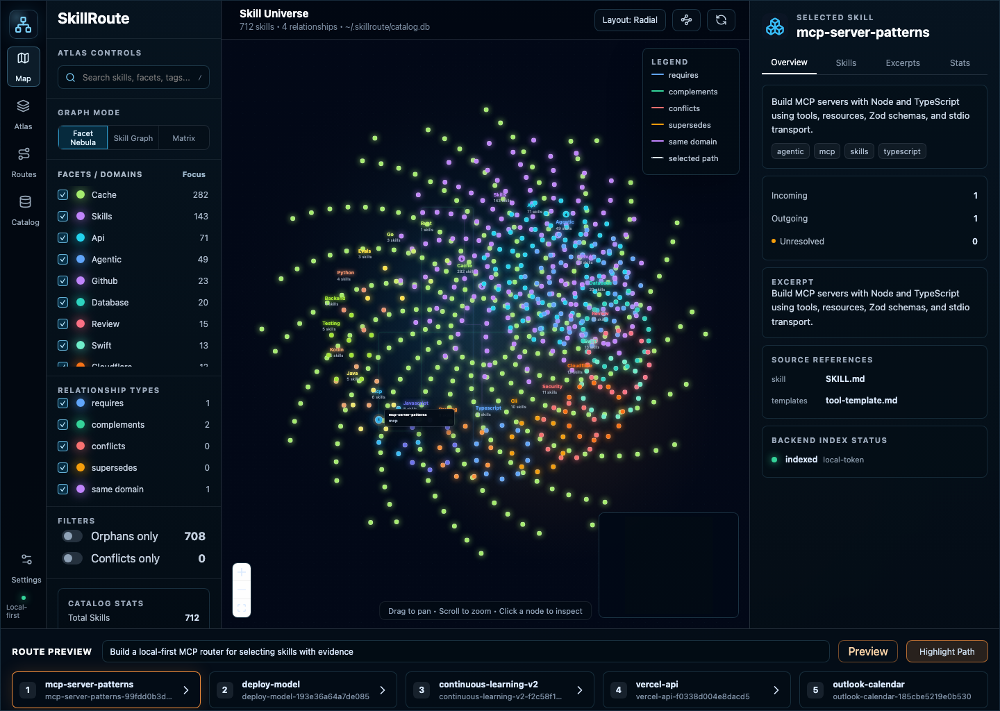
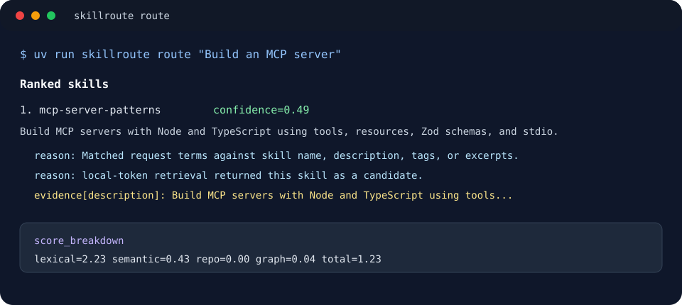
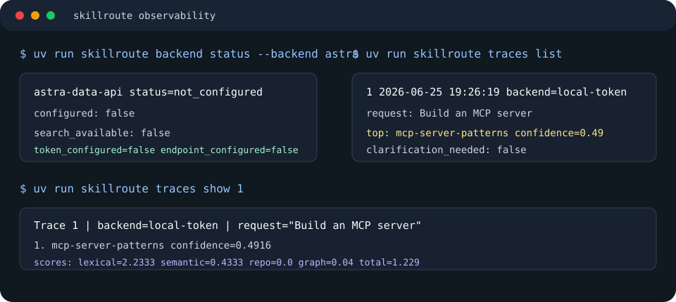
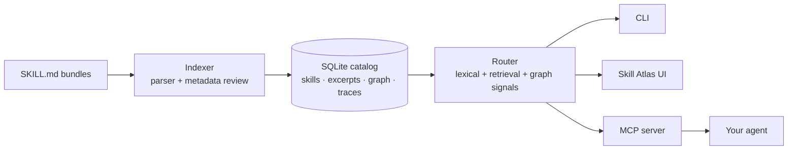

<div align="center">

# 🧭 SkillRoute

### Local-first skill routing for agent builders

Index full `SKILL.md` bundles into a local catalog, route any request to ranked
skills with confidence and evidence, and serve it all to your agents over MCP.

[](https://github.com/erichare/skillroute/actions/workflows/ci.yml)
[](LICENSE)
[](pyproject.toml)
[](docs/mcp-server.md)

[Quick start](#quick-start) · [Skill Atlas](#skill-atlas) · [Agent setup](#plug-it-into-your-agent) · [How it works](#how-it-works) · [Docs](#docs)

<br>



<sub><b>Skill Atlas</b> — every skill in your library on one interactive map, with live route previews.</sub>

</div>

---

## Why

Most agents choose skills from a one-line description and hope for the best.
SkillRoute treats your skill library like a real corpus:

- **Full-bundle indexing** — parses complete `SKILL.md` bundles (headings,
  triggers, templates, relationships), not just frontmatter.
- **Explainable routes** — every ranked skill carries confidence, reasons, and
  source evidence. Uncertain routes return clarification questions instead of
  guesses.
- **Local first** — one SQLite file, no services to run. Add the Astra DB
  backend when you outgrow it.

## Built on the Agent Skills open standard

SkillRoute is built around [Agent Skills](https://agentskills.io/home), the
open standard for `SKILL.md` bundles. Every bundle you index is checked
against the [specification](https://agentskills.io/specification), and a
standalone validator doubles as a CI gate for skill authors:

```bash
uv run skillroute validate examples/skills          # report
uv run skillroute validate --strict                 # fail on warnings too
uv run skillroute index --root examples/skills --strict   # refuse non-compliant bundles
```

```text
Spec check (https://agentskills.io/specification): 4 bundles, 0 errors, 0 warnings
```

See [Spec Compliance](docs/spec-compliance.md) for the full rule set.

## Quick start

One guided line (confirms each step, sets up detected agent clients with
backups):

```bash
curl -fsSL https://raw.githubusercontent.com/erichare/skillroute/main/scripts/install.sh | bash
```

Or hands-on, in a checkout:

```bash
uv run skillroute index --root examples/skills
uv run skillroute route "Build an MCP server that exposes routing tools"
```



<details>
<summary>Actual text output</summary>

```text
Ranked skills:
1. mcp-server-patterns (mcp-server-patterns-99fdd0b3d944c32a) confidence=0.3563
   Build MCP servers with Node and TypeScript using tools, resources, Zod schemas, and stdio transport.
   reason: Matched request terms against skill name, description, tags, or excerpts.
   reason: local-token retrieval returned this skill as a candidate.
   reason: Skill graph relationships provide supporting context.
   evidence[description]: Build MCP servers with Node and TypeScript using tools, resources, Zod schemas, and stdio transport.
   evidence[headings]: MCP Server Patterns; When to Use
2. python-testing (python-testing-19ef6ae9ced445b2) confidence=0.1373
   Test Python applications with pytest fixtures, parametrization, temporary paths, and regression coverage.
   ...
```

</details>

The default catalog lives at `~/.skillroute/catalog.db`. A `.skillroute/catalog.db`
in the working directory is used instead when one already exists, so existing
project catalogs keep working; point elsewhere with
`--catalog <path>` or `SKILLROUTE_CATALOG_PATH`.

## Skill Atlas

Your whole library, mapped. Facet nebula, skill graph, and matrix views;
filters for domains, relationship types, orphans, and conflicts; a detail panel
with excerpts and source references; and a route preview bar that highlights
the chosen path through the graph.

```bash
uv run skillroute ui
```

## Plug it into your agent

The bundled MCP server exposes three tools over stdio — `skillroute.route`,
`skillroute.search`, and `skillroute.inspect_skill`. One command writes the
config for your harness (JSON edits are backed up first):

```bash
uv run skillroute harness install claude-code
uv run skillroute harness detect        # what is installed here
uv run skillroute harness list          # everything SkillRoute knows about
```

Supported harnesses: `amp` · `claude-code` · `claude-desktop` · `codex` ·
`cursor` · `deepseek` · `gemini-cli` · `goose` · `hermes` · `ibm-bob` · `opencode` · `pi` ·
`vscode` · `windsurf` · `zed`

Each one is a single declarative manifest in [`harnesses/`](harnesses), so
adding a new tool is usually a data change with no Python — see
[Harness Packs](docs/harnesses.md).

**DeepSeek Harness** installs as a bundle instead, with one command:

```bash
dsh plugin --profile web add @skillroute/dsh-plugin
```

The bundle registers SkillRoute's MCP server through dsh's built-in
`@deepseek-ai/dsh-mcp-client`, giving agents `mcp__skillroute__route`,
`mcp__skillroute__search`, and `mcp__skillroute__inspect_skill`. The Python
core is zero-install when `uv` is present (the bridge runs
`uvx --from skillroute`); otherwise `pipx install skillroute` once. See
[`dsh-plugin/README.md`](dsh-plugin/README.md).

## Route observability

Every route is a trace you can replay: inputs, candidates, scores, and the
evidence behind each decision. Golden-route evals keep your catalog honest as
it grows.



```bash
uv run skillroute traces list
uv run skillroute eval run --fresh --index-root examples/skills --cases examples/evals/golden_routes.json
```

## How it works


```mermaid
flowchart LR
    A["SKILL.md bundles"] --> B["Indexer<br/>parser + metadata review"]
    B --> C[("SQLite catalog<br/>skills · excerpts · graph · traces")]
    C --> D["Router<br/>lexical + retrieval + graph signals"]
    D --> E["CLI"]
    D --> F["Skill Atlas UI"]
    D --> G["MCP server"]
    G --> H["Your agent"]
```

- **Python core** — parsing, catalog persistence, hybrid routing, evals, CLI.
- **Skill Atlas** — FastAPI server + React Flow frontend, bundled into the
  Python wheel.
- **MCP server** — TypeScript stdio transport around the Python bridge.
- **Backends** — local token retrieval by default; SQLite FTS5 (BM25) for
  larger local libraries, Astra DB Data API and a LangChain-compatible adapter
  when you want more.

## CLI at a glance

| Command | What it does |
| --- | --- |
| `skillroute index --root <dir>` | Parse and index `SKILL.md` bundles |
| `skillroute route "<request>"` | Ranked skills with confidence and evidence |
| `skillroute search "<query>"` | Hybrid search across the catalog |
| `skillroute inspect <skill>` | Metadata, relationships, excerpts, sources |
| `skillroute validate [paths]` | Check bundles against the Agent Skills spec |
| `skillroute traces list` | Inspect past routing decisions |
| `skillroute eval run` | Golden-route evals against expected outcomes |
| `skillroute backend status` | Retrieval backend health |
| `skillroute harness list` | Every harness SkillRoute supports, and its modes |
| `skillroute harness install <harness>` | Configure a harness to use SkillRoute |
| `skillroute ui` | Launch the Skill Atlas |

## Docs

| Guide | |
| --- | --- |
| [Getting Started](docs/getting-started.md) | Index, route, and inspect in five minutes |
| [Spec Compliance](docs/spec-compliance.md) | Validate bundles against the Agent Skills spec |
| [Harness Packs](docs/harnesses.md) | Supported harnesses, install modes, and how to add one |
| [Agent Setup](docs/agent-setup.md) | Wire SkillRoute into your agent clients |
| [MCP Server](docs/mcp-server.md) | Tools, transport, and configuration |
| [Skill Atlas UI](docs/skill-atlas.md) | The graph explorer in depth |
| [Route Observability](docs/route-observability.md) | Traces and debugging routes |
| [Golden Route Evals](docs/evals.md) | Keep routing quality measurable |
| [Metadata Overlays](docs/metadata-overlays.md) | Curate tags without editing sources |
| [Astra Data API Backend](docs/astra-backend.md) | Remote vector retrieval |
| [Changelog](CHANGELOG.md) | Release history |

## Development

```bash
uv sync --extra dev   # dev includes the `ui` extra
uv run --extra dev pytest --cov=skillroute
uv run --extra dev ruff check . && uv run --extra dev mypy
```

See [CONTRIBUTING.md](CONTRIBUTING.md) for the full dev setup (web UI, MCP
server) and the release process.

---

<div align="center">
<sub>MIT © <a href="https://github.com/erichare">Eric Hare</a> — for people who take their skill libraries seriously.</sub>
</div>
